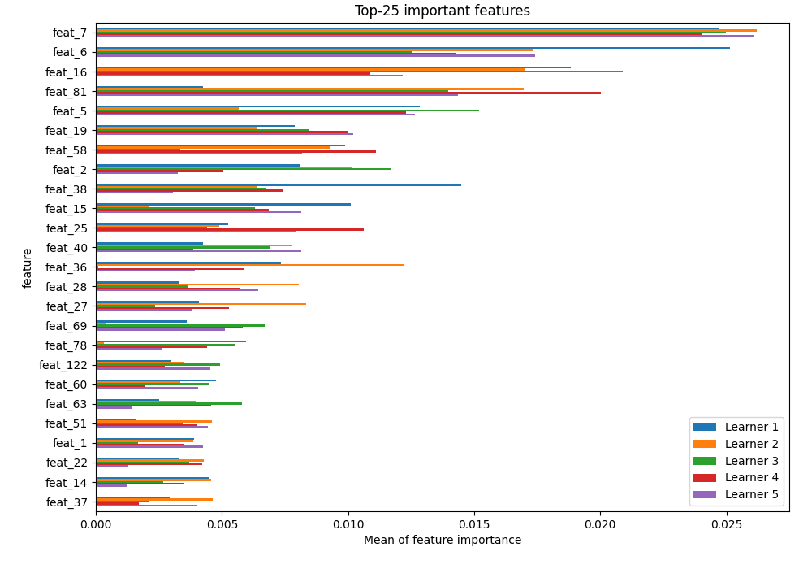

# Summary of 13_CatBoost

[<< Go back](../README.md)

## CatBoost
- **n_jobs**: -1
- **learning_rate**: 0.15
- **depth**: 3
- **rsm**: 1.0
- **loss_function**: MultiClass
- **eval_metric**: MultiClass
- **num_class**: 3
- **explain_level**: 2

## Validation
 - **validation_type**: kfold
 - **k_folds**: 5
 - **shuffle**: True
 - **stratify**: True

## Optimized metric
logloss

## Training time

60.0 seconds

### Metric details
|           |      VL_01 |       VL_02 |       VL_03 |   accuracy |   macro avg |   weighted avg |   logloss |
|:----------|-----------:|------------:|------------:|-----------:|------------:|---------------:|----------:|
| precision |   0.5      |    0.549296 |    0.572136 |   0.553083 |    0.540477 |       0.547635 |  0.926525 |
| recall    |   0.268263 |    0.651671 |    0.608696 |   0.553083 |    0.509543 |       0.553083 |  0.926525 |
| f1-score  |   0.349182 |    0.59612  |    0.58985  |   0.553083 |    0.511717 |       0.540937 |  0.926525 |
| support   | 835        | 1556        | 1518        |   0.553083 | 3909        |    3909        |  0.926525 |

## Confusion matrix
|                  |   Predicted as VL_01 |   Predicted as VL_02 |   Predicted as VL_03 |
|:-----------------|---------------------:|---------------------:|---------------------:|
| Labeled as VL_01 |                  224 |                  338 |                  273 |
| Labeled as VL_02 |                  124 |                 1014 |                  418 |
| Labeled as VL_03 |                  100 |                  494 |                  924 |

## Learning curves

## Permutation-based Importance

## Confusion Matrix

## Normalized Confusion Matrix

## ROC Curve

## Precision Recall Curve

[<< Go back](../README.md)
