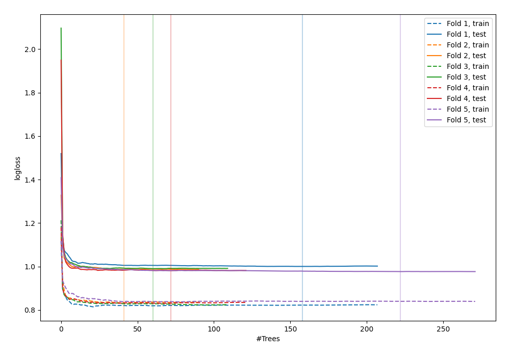
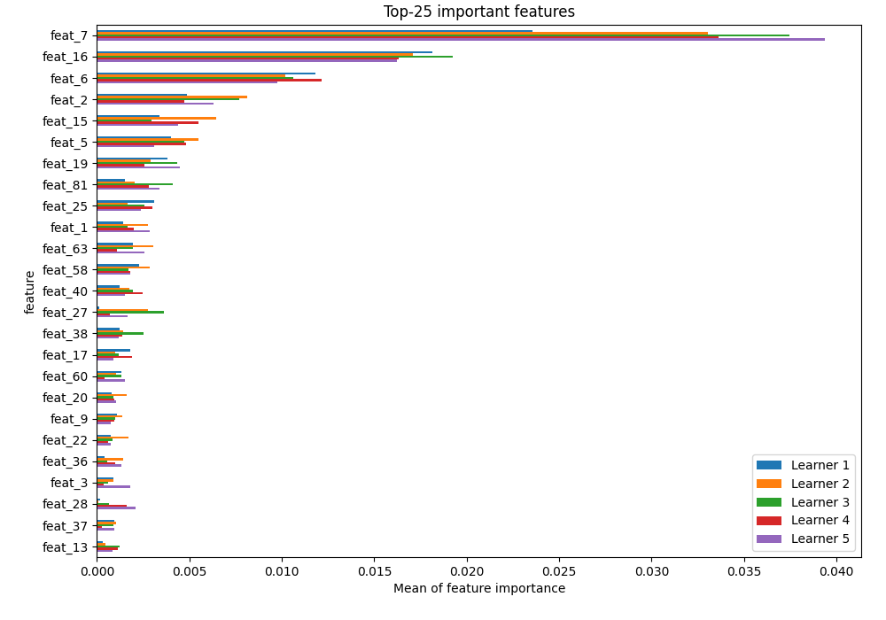
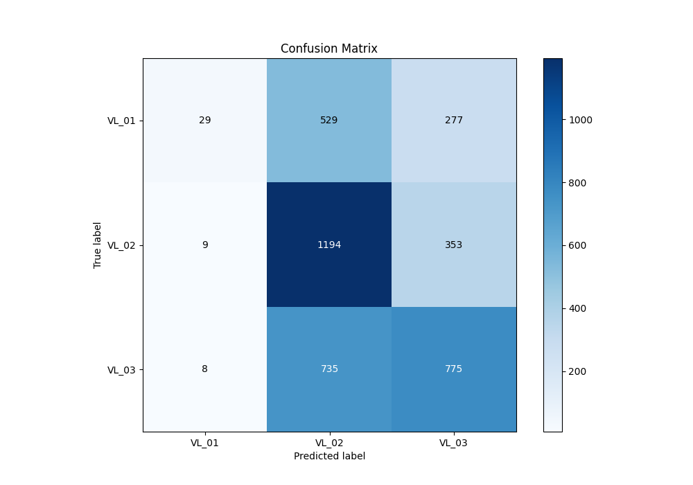
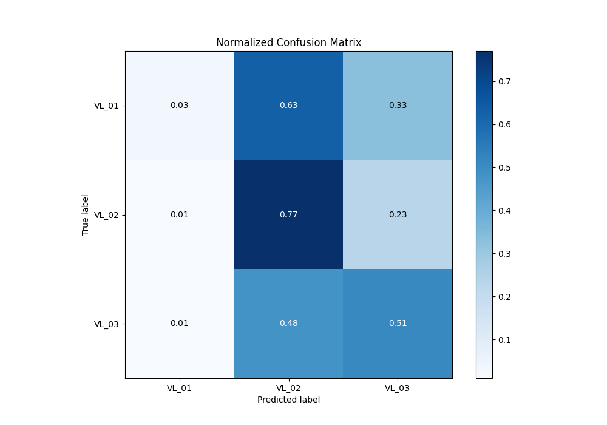
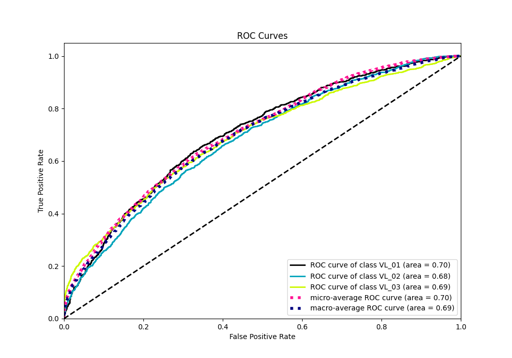
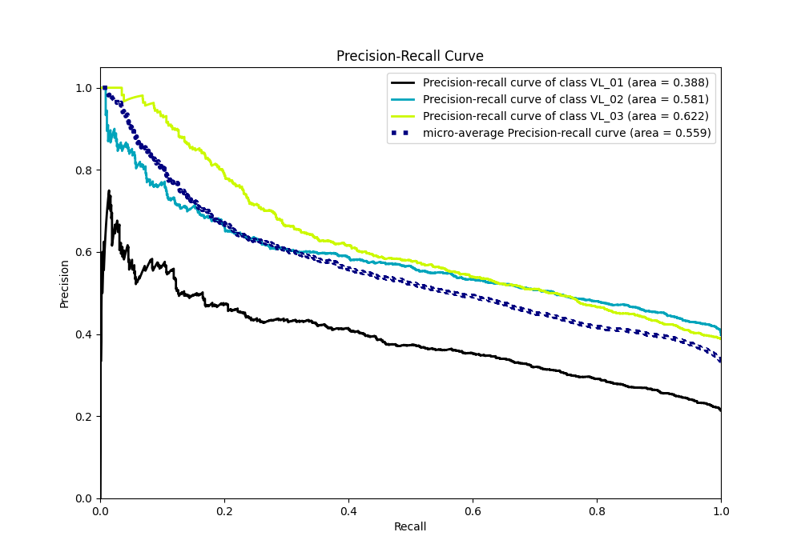

# Summary of 17_RandomForest

[<< Go back](../README.md)

## Random Forest
- **n_jobs**: -1
- **criterion**: entropy
- **max_features**: 0.8
- **min_samples_split**: 50
- **max_depth**: 7
- **eval_metric_name**: logloss
- **num_class**: 3
- **explain_level**: 2

## Validation
 - **validation_type**: kfold
 - **k_folds**: 5
 - **shuffle**: True
 - **stratify**: True

## Optimized metric
logloss

## Training time

366.0 seconds

### Metric details
|           |       VL_01 |       VL_02 |       VL_03 |   accuracy |   macro avg |   weighted avg |   logloss |
|:----------|------------:|------------:|------------:|-----------:|------------:|---------------:|----------:|
| precision |   0.630435  |    0.485761 |    0.551601 |   0.511128 |    0.555932 |       0.542233 |  0.986891 |
| recall    |   0.0347305 |    0.767352 |    0.51054  |   0.511128 |    0.437541 |       0.511128 |  0.986891 |
| f1-score  |   0.0658343 |    0.594918 |    0.530277 |   0.511128 |    0.39701  |       0.456798 |  0.986891 |
| support   | 835         | 1556        | 1518        |   0.511128 | 3909        |    3909        |  0.986891 |

## Confusion matrix
|                  |   Predicted as VL_01 |   Predicted as VL_02 |   Predicted as VL_03 |
|:-----------------|---------------------:|---------------------:|---------------------:|
| Labeled as VL_01 |                   29 |                  529 |                  277 |
| Labeled as VL_02 |                    9 |                 1194 |                  353 |
| Labeled as VL_03 |                    8 |                  735 |                  775 |

## Learning curves

## Permutation-based Importance

## Confusion Matrix

## Normalized Confusion Matrix

## ROC Curve

## Precision Recall Curve

[<< Go back](../README.md)
