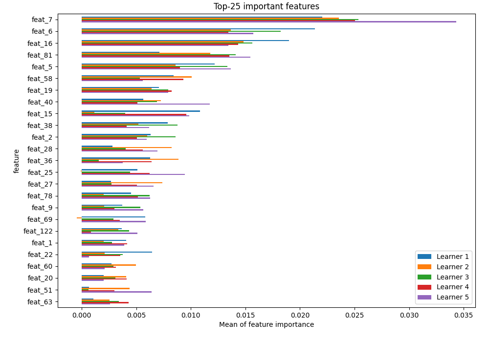

# Summary of 18_CatBoost

[<< Go back](../README.md)

## CatBoost
- **n_jobs**: -1
- **learning_rate**: 0.1
- **depth**: 5
- **rsm**: 1
- **loss_function**: MultiClass
- **eval_metric**: MultiClass
- **num_class**: 3
- **explain_level**: 2

## Validation
 - **validation_type**: kfold
 - **k_folds**: 5
 - **shuffle**: True
 - **stratify**: True

## Optimized metric
logloss

## Training time

120.4 seconds

### Metric details
|           |      VL_01 |       VL_02 |       VL_03 |   accuracy |   macro avg |   weighted avg |   logloss |
|:----------|-----------:|------------:|------------:|-----------:|------------:|---------------:|----------:|
| precision |   0.544503 |    0.551471 |    0.568084 |   0.557687 |    0.554686 |       0.556434 |  0.921314 |
| recall    |   0.249102 |    0.674807 |    0.607378 |   0.557687 |    0.510429 |       0.557687 |  0.921314 |
| f1-score  |   0.341824 |    0.606936 |    0.587074 |   0.557687 |    0.511945 |       0.542593 |  0.921314 |
| support   | 835        | 1556        | 1518        |   0.557687 | 3909        |    3909        |  0.921314 |

## Confusion matrix
|                  |   Predicted as VL_01 |   Predicted as VL_02 |   Predicted as VL_03 |
|:-----------------|---------------------:|---------------------:|---------------------:|
| Labeled as VL_01 |                  208 |                  337 |                  290 |
| Labeled as VL_02 |                   95 |                 1050 |                  411 |
| Labeled as VL_03 |                   79 |                  517 |                  922 |

## Learning curves

## Permutation-based Importance

## Confusion Matrix

## Normalized Confusion Matrix

## ROC Curve

## Precision Recall Curve

[<< Go back](../README.md)
