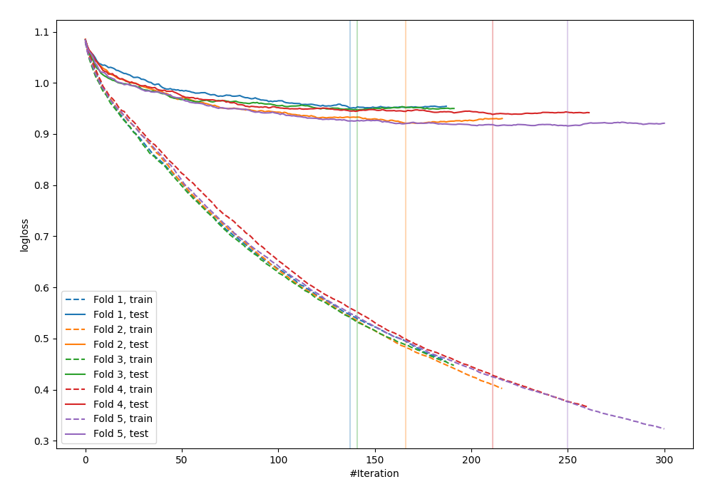
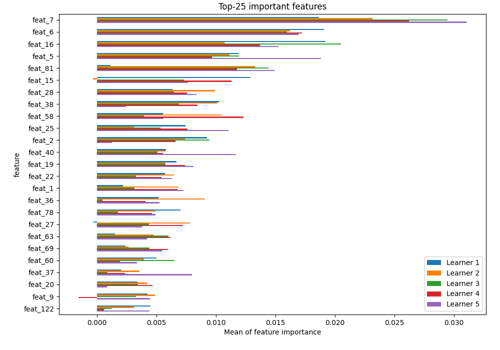
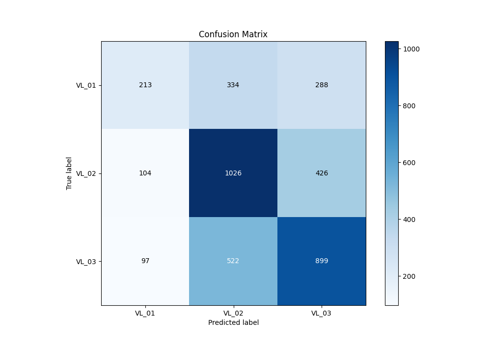
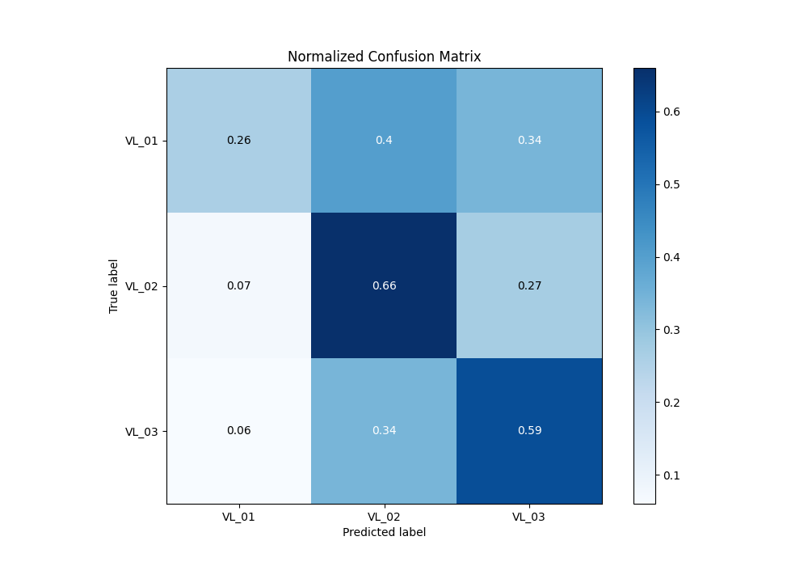
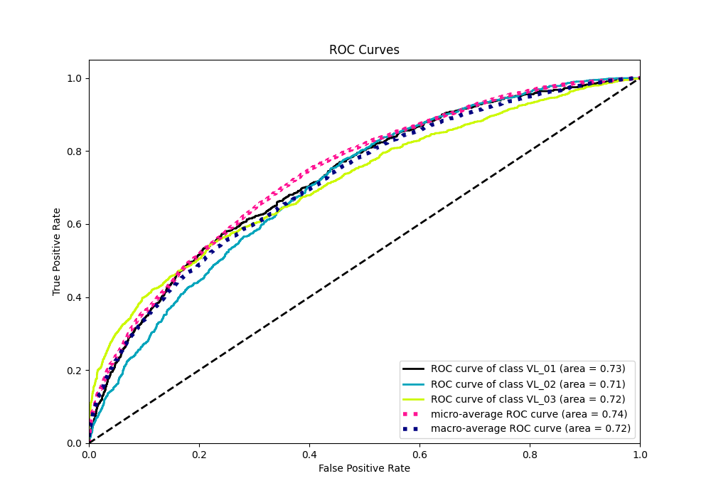
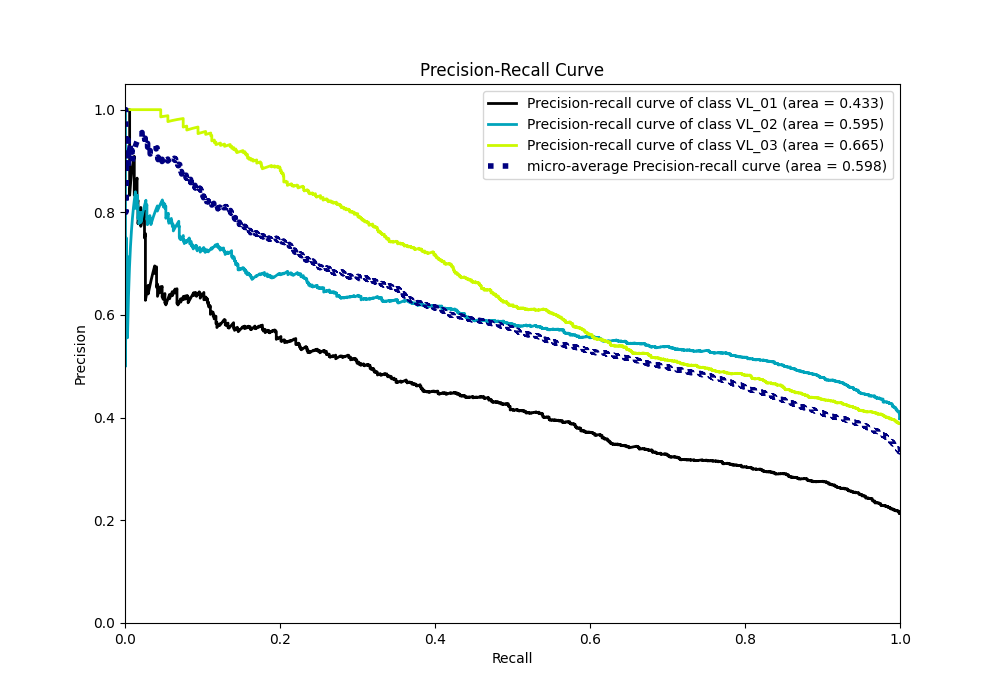

# Summary of 19_CatBoost

[<< Go back](../README.md)

## CatBoost
- **n_jobs**: -1
- **learning_rate**: 0.2
- **depth**: 5
- **rsm**: 1
- **loss_function**: MultiClass
- **eval_metric**: MultiClass
- **num_class**: 3
- **explain_level**: 2

## Validation
 - **validation_type**: kfold
 - **k_folds**: 5
 - **shuffle**: True
 - **stratify**: True

## Optimized metric
logloss

## Training time

77.6 seconds

### Metric details
|           |      VL_01 |       VL_02 |       VL_03 |   accuracy |   macro avg |   weighted avg |   logloss |
|:----------|-----------:|------------:|------------:|-----------:|------------:|---------------:|----------:|
| precision |   0.514493 |    0.545165 |    0.557347 |   0.546943 |    0.539001 |       0.543344 |  0.934521 |
| recall    |   0.25509  |    0.659383 |    0.592227 |   0.546943 |    0.502233 |       0.546943 |  0.934521 |
| f1-score  |   0.341073 |    0.596859 |    0.574257 |   0.546943 |    0.504063 |       0.533444 |  0.934521 |
| support   | 835        | 1556        | 1518        |   0.546943 | 3909        |    3909        |  0.934521 |

## Confusion matrix
|                  |   Predicted as VL_01 |   Predicted as VL_02 |   Predicted as VL_03 |
|:-----------------|---------------------:|---------------------:|---------------------:|
| Labeled as VL_01 |                  213 |                  334 |                  288 |
| Labeled as VL_02 |                  104 |                 1026 |                  426 |
| Labeled as VL_03 |                   97 |                  522 |                  899 |

## Learning curves

## Permutation-based Importance

## Confusion Matrix

## Normalized Confusion Matrix

## ROC Curve

## Precision Recall Curve

[<< Go back](../README.md)
