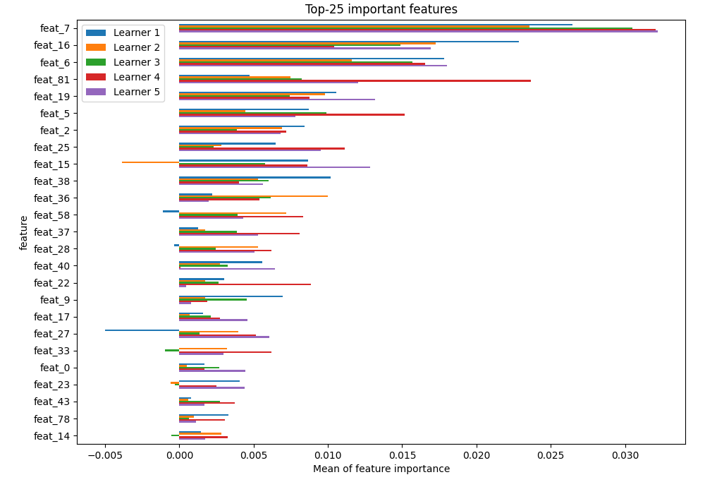
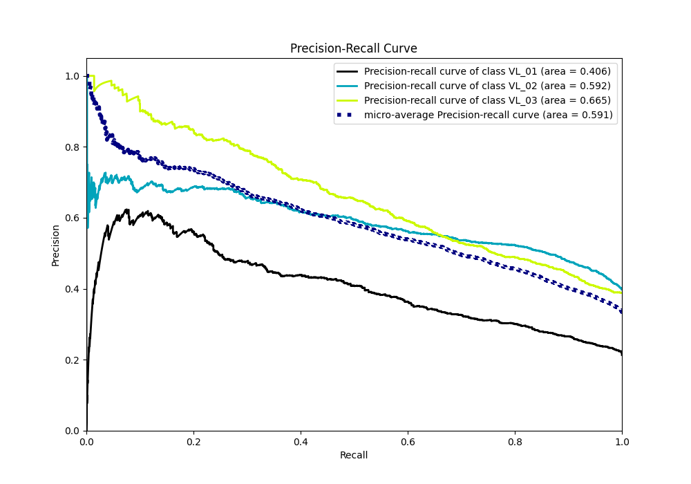

# Summary of 1_Default_LightGBM

[<< Go back](../README.md)

## LightGBM
- **n_jobs**: -1
- **objective**: multiclass
- **num_leaves**: 63
- **learning_rate**: 0.05
- **feature_fraction**: 0.9
- **bagging_fraction**: 0.9
- **min_data_in_leaf**: 10
- **metric**: multi_logloss
- **custom_eval_metric_name**: None
- **num_class**: 3
- **explain_level**: 2

## Validation
 - **validation_type**: kfold
 - **k_folds**: 5
 - **shuffle**: True
 - **stratify**: True

## Optimized metric
logloss

## Training time

156.2 seconds

### Metric details
|           |      VL_01 |       VL_02 |       VL_03 |   accuracy |   macro avg |   weighted avg |   logloss |
|:----------|-----------:|------------:|------------:|-----------:|------------:|---------------:|----------:|
| precision |   0.54417  |    0.537255 |    0.583228 |   0.556408 |    0.554884 |       0.556585 |  0.942801 |
| recall    |   0.184431 |    0.70437  |    0.609354 |   0.556408 |    0.499385 |       0.556408 |  0.942801 |
| f1-score  |   0.275492 |    0.609566 |    0.596005 |   0.556408 |    0.493688 |       0.532938 |  0.942801 |
| support   | 835        | 1556        | 1518        |   0.556408 | 3909        |    3909        |  0.942801 |

## Confusion matrix
|                  |   Predicted as VL_01 |   Predicted as VL_02 |   Predicted as VL_03 |
|:-----------------|---------------------:|---------------------:|---------------------:|
| Labeled as VL_01 |                  154 |                  411 |                  270 |
| Labeled as VL_02 |                   69 |                 1096 |                  391 |
| Labeled as VL_03 |                   60 |                  533 |                  925 |

## Learning curves

## Permutation-based Importance

## Confusion Matrix

## Normalized Confusion Matrix

## ROC Curve

## Precision Recall Curve

[<< Go back](../README.md)
