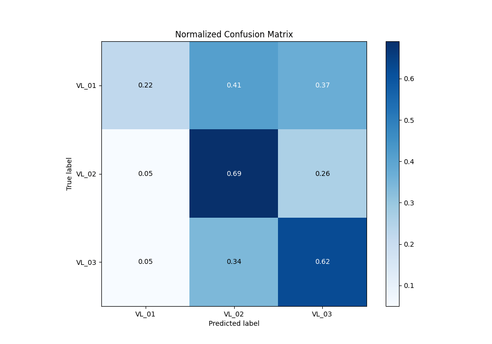

# Summary of 20_Xgboost

[<< Go back](../README.md)

## Extreme Gradient Boosting (Xgboost)
- **n_jobs**: -1
- **objective**: multi:softprob
- **eta**: 0.1
- **max_depth**: 7
- **min_child_weight**: 5
- **subsample**: 0.9
- **colsample_bytree**: 0.5
- **eval_metric**: mlogloss
- **num_class**: 3
- **explain_level**: 2

## Validation
 - **validation_type**: kfold
 - **k_folds**: 5
 - **shuffle**: True
 - **stratify**: True

## Optimized metric
logloss

## Training time

94.0 seconds

### Metric details
|           |      VL_01 |       VL_02 |       VL_03 |   accuracy |   macro avg |   weighted avg |   logloss |
|:----------|-----------:|------------:|------------:|-----------:|------------:|---------------:|----------:|
| precision |   0.554878 |    0.555959 |    0.566929 |   0.560501 |    0.559255 |       0.559988 |   0.92834 |
| recall    |   0.217964 |    0.689589 |    0.616601 |   0.560501 |    0.508051 |       0.560501 |   0.92834 |
| f1-score  |   0.312984 |    0.615605 |    0.590723 |   0.560501 |    0.506437 |       0.5413   |   0.92834 |
| support   | 835        | 1556        | 1518        |   0.560501 | 3909        |    3909        |   0.92834 |

## Confusion matrix
|                  |   Predicted as VL_01 |   Predicted as VL_02 |   Predicted as VL_03 |
|:-----------------|---------------------:|---------------------:|---------------------:|
| Labeled as VL_01 |                  182 |                  346 |                  307 |
| Labeled as VL_02 |                   75 |                 1073 |                  408 |
| Labeled as VL_03 |                   71 |                  511 |                  936 |

## Learning curves

## Permutation-based Importance

## Confusion Matrix

## Normalized Confusion Matrix

## ROC Curve

## Precision Recall Curve

[<< Go back](../README.md)
