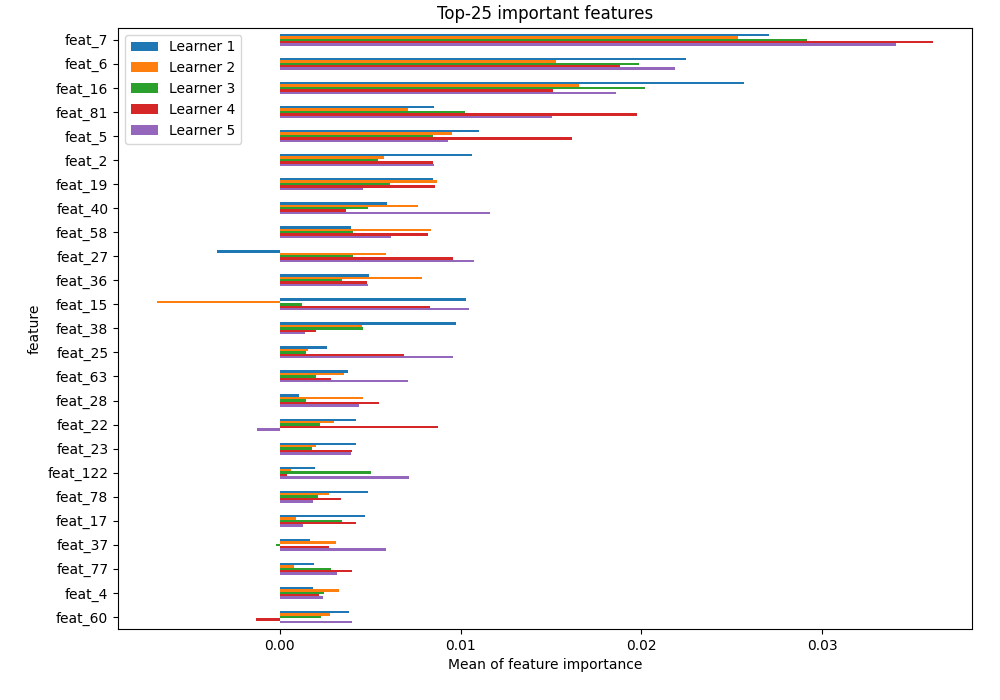

# Summary of 2_Default_Xgboost

[<< Go back](../README.md)

## Extreme Gradient Boosting (Xgboost)
- **n_jobs**: -1
- **objective**: multi:softprob
- **eta**: 0.075
- **max_depth**: 6
- **min_child_weight**: 1
- **subsample**: 1.0
- **colsample_bytree**: 1.0
- **eval_metric**: mlogloss
- **num_class**: 3
- **explain_level**: 2

## Validation
 - **validation_type**: split
 - **train_ratio**: 0.75
 - **shuffle**: True
 - **stratify**: True

## Optimized metric
logloss

## Training time

17.5 seconds

### Metric details
|           |      VL_01 |      VL_02 |      VL_03 |   accuracy |   macro avg |   weighted avg |   logloss |
|:----------|-----------:|-----------:|-----------:|-----------:|------------:|---------------:|----------:|
| precision |   0.475    |   0.52907  |   0.578534 |   0.543967 |    0.527535 |       0.536734 |  0.945977 |
| recall    |   0.181818 |   0.701799 |   0.581579 |   0.543967 |    0.488399 |       0.543967 |  0.945977 |
| f1-score  |   0.262976 |   0.603315 |   0.580052 |   0.543967 |    0.482114 |       0.521545 |  0.945977 |
| support   | 209        | 389        | 380        |   0.543967 |  978        |     978        |  0.945977 |

## Confusion matrix
|                  |   Predicted as VL_01 |   Predicted as VL_02 |   Predicted as VL_03 |
|:-----------------|---------------------:|---------------------:|---------------------:|
| Labeled as VL_01 |                   38 |                  105 |                   66 |
| Labeled as VL_02 |                   21 |                  273 |                   95 |
| Labeled as VL_03 |                   21 |                  138 |                  221 |

## Learning curves

## Permutation-based Importance

## Confusion Matrix

## Normalized Confusion Matrix

## ROC Curve

## Precision Recall Curve

[<< Go back](../README.md)
