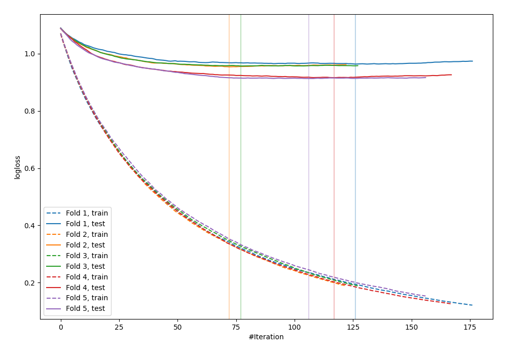
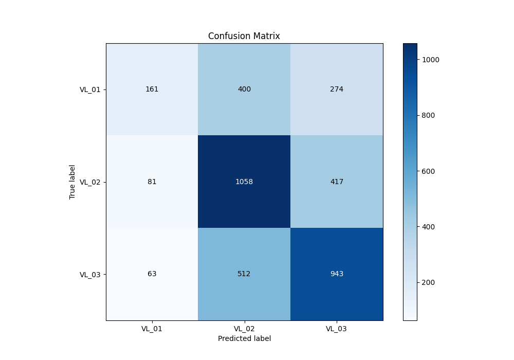
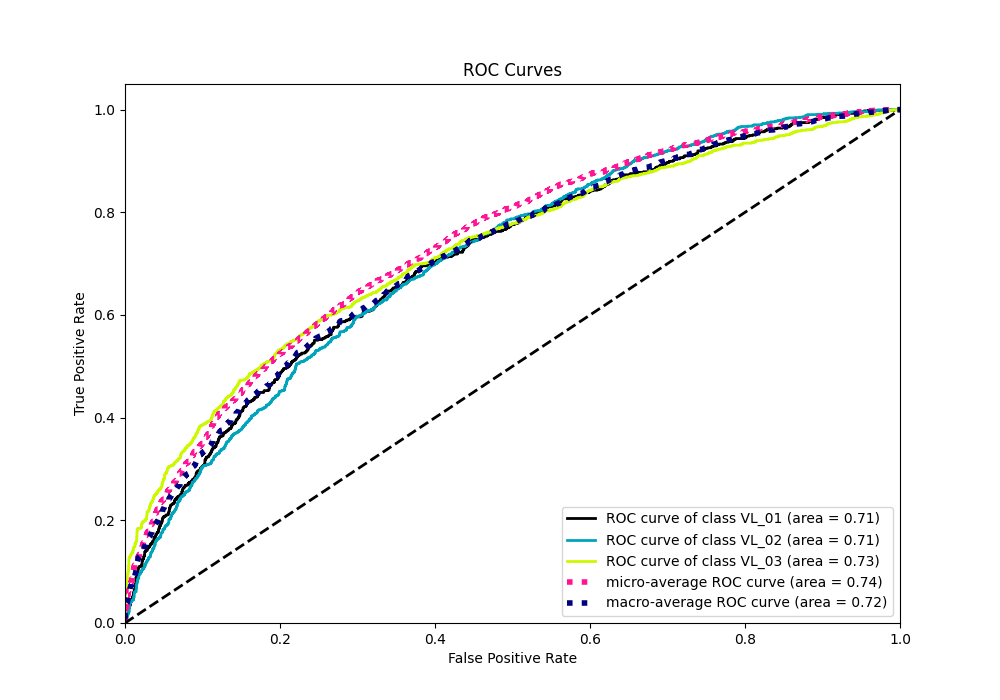

# Summary of 2_Default_Xgboost

[<< Go back](../README.md)

## Extreme Gradient Boosting (Xgboost)
- **n_jobs**: -1
- **objective**: multi:softprob
- **eta**: 0.075
- **max_depth**: 6
- **min_child_weight**: 1
- **subsample**: 1.0
- **colsample_bytree**: 1.0
- **eval_metric**: mlogloss
- **num_class**: 3
- **explain_level**: 2

## Validation
 - **validation_type**: kfold
 - **k_folds**: 5
 - **shuffle**: True
 - **stratify**: True

## Optimized metric
logloss

## Training time

112.2 seconds

### Metric details
|           |      VL_01 |       VL_02 |       VL_03 |   accuracy |   macro avg |   weighted avg |   logloss |
|:----------|-----------:|------------:|------------:|-----------:|------------:|---------------:|----------:|
| precision |   0.527869 |    0.537056 |    0.577111 |   0.553083 |    0.547345 |       0.550648 |  0.940617 |
| recall    |   0.192814 |    0.679949 |    0.621212 |   0.553083 |    0.497992 |       0.553083 |  0.940617 |
| f1-score  |   0.282456 |    0.600113 |    0.59835  |   0.553083 |    0.49364  |       0.531574 |  0.940617 |
| support   | 835        | 1556        | 1518        |   0.553083 | 3909        |    3909        |  0.940617 |

## Confusion matrix
|                  |   Predicted as VL_01 |   Predicted as VL_02 |   Predicted as VL_03 |
|:-----------------|---------------------:|---------------------:|---------------------:|
| Labeled as VL_01 |                  161 |                  400 |                  274 |
| Labeled as VL_02 |                   81 |                 1058 |                  417 |
| Labeled as VL_03 |                   63 |                  512 |                  943 |

## Learning curves

## Permutation-based Importance

## Confusion Matrix

## Normalized Confusion Matrix

## ROC Curve

## Precision Recall Curve

[<< Go back](../README.md)
