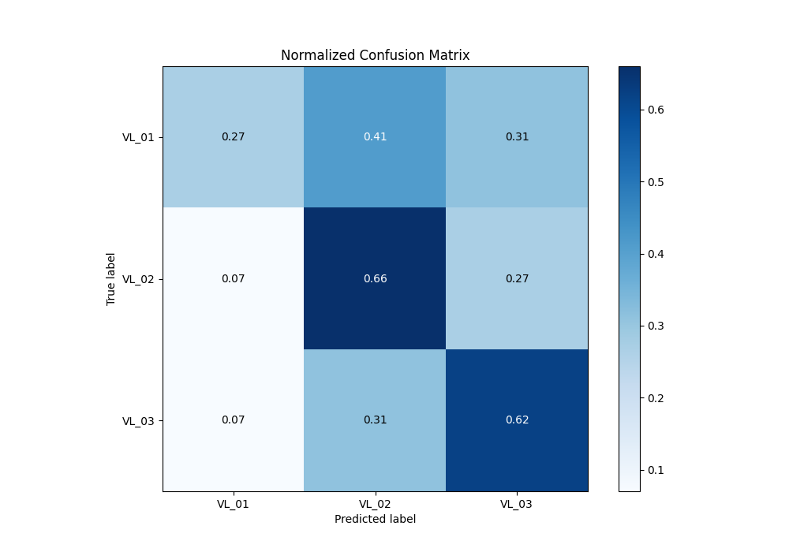

# Summary of 3_Default_CatBoost

[<< Go back](../README.md)

## CatBoost
- **n_jobs**: -1
- **learning_rate**: 0.15
- **depth**: 5
- **rsm**: 1
- **loss_function**: MultiClass
- **eval_metric**: MultiClass
- **num_class**: 3
- **explain_level**: 2

## Validation
 - **validation_type**: split
 - **train_ratio**: 0.75
 - **shuffle**: True
 - **stratify**: True

## Optimized metric
logloss

## Training time

18.7 seconds

### Metric details
|           |      VL_01 |      VL_02 |      VL_03 |   accuracy |   macro avg |   weighted avg |   logloss |
|:----------|-----------:|-----------:|-----------:|-----------:|------------:|---------------:|----------:|
| precision |   0.472868 |   0.575556 |   0.596491 |   0.570552 |    0.548305 |       0.561746 |  0.923381 |
| recall    |   0.291866 |   0.66581  |   0.626316 |   0.570552 |    0.527997 |       0.570552 |  0.923381 |
| f1-score  |   0.360947 |   0.617402 |   0.61104  |   0.570552 |    0.529796 |       0.560125 |  0.923381 |
| support   | 209        | 389        | 380        |   0.570552 |  978        |     978        |  0.923381 |

## Confusion matrix
|                  |   Predicted as VL_01 |   Predicted as VL_02 |   Predicted as VL_03 |
|:-----------------|---------------------:|---------------------:|---------------------:|
| Labeled as VL_01 |                   61 |                   83 |                   65 |
| Labeled as VL_02 |                   34 |                  259 |                   96 |
| Labeled as VL_03 |                   34 |                  108 |                  238 |

## Learning curves

## Permutation-based Importance

## Confusion Matrix

## Normalized Confusion Matrix

## ROC Curve

## Precision Recall Curve

[<< Go back](../README.md)
