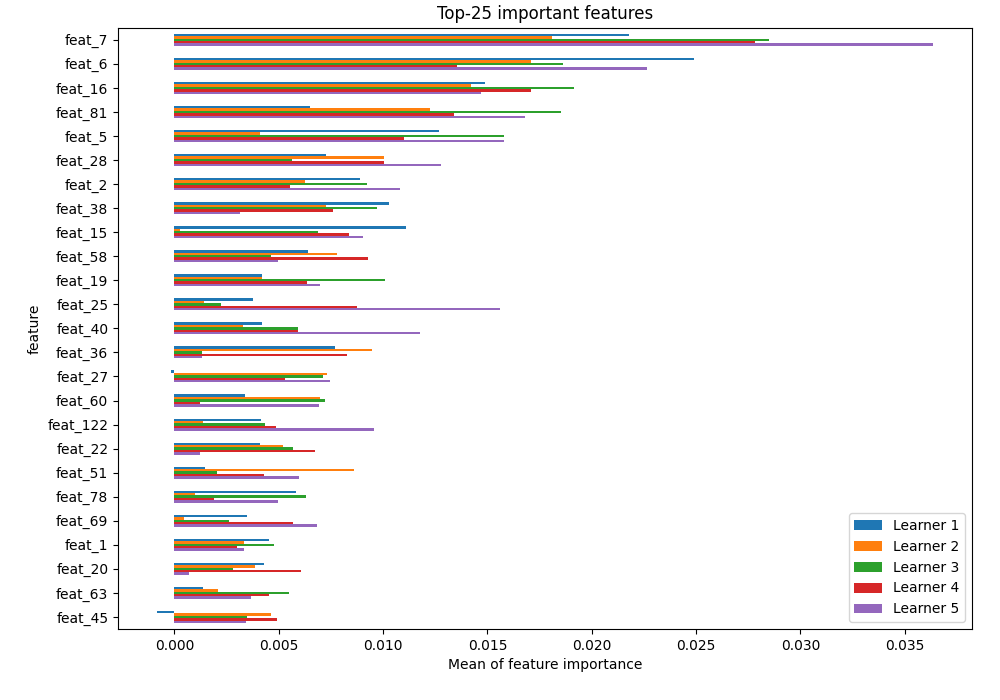
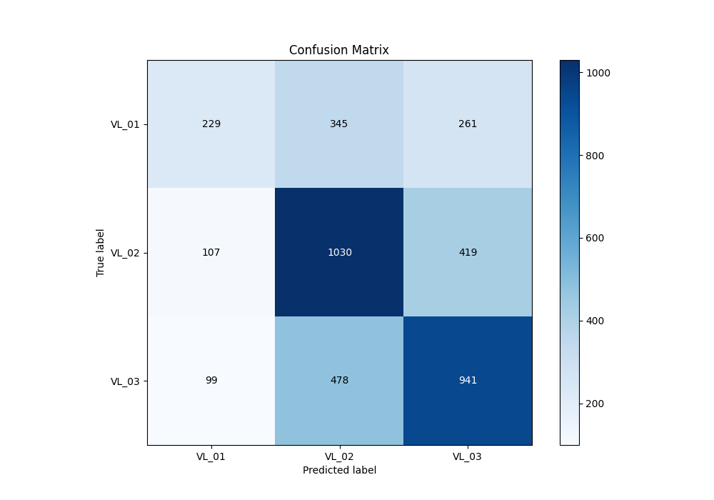
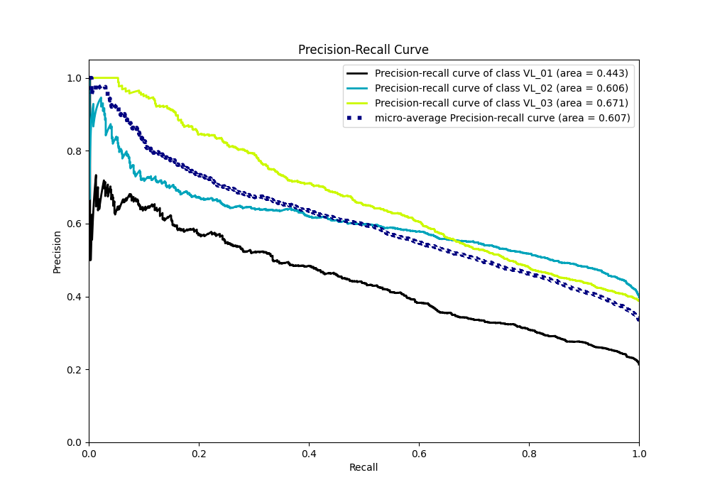

# Summary of 3_Default_CatBoost

[<< Go back](../README.md)

## CatBoost
- **n_jobs**: -1
- **learning_rate**: 0.15
- **depth**: 5
- **rsm**: 1
- **loss_function**: MultiClass
- **eval_metric**: MultiClass
- **num_class**: 3
- **explain_level**: 2

## Validation
 - **validation_type**: kfold
 - **k_folds**: 5
 - **shuffle**: True
 - **stratify**: True

## Optimized metric
logloss

## Training time

107.3 seconds

### Metric details
|           |      VL_01 |       VL_02 |       VL_03 |   accuracy |   macro avg |   weighted avg |   logloss |
|:----------|-----------:|------------:|------------:|-----------:|------------:|---------------:|----------:|
| precision |   0.526437 |    0.555855 |    0.580506 |   0.562804 |    0.554266 |       0.559144 |  0.924329 |
| recall    |   0.274251 |    0.661954 |    0.619895 |   0.562804 |    0.5187   |       0.562804 |  0.924329 |
| f1-score  |   0.36063  |    0.604283 |    0.599554 |   0.562804 |    0.521489 |       0.5504   |  0.924329 |
| support   | 835        | 1556        | 1518        |   0.562804 | 3909        |    3909        |  0.924329 |

## Confusion matrix
|                  |   Predicted as VL_01 |   Predicted as VL_02 |   Predicted as VL_03 |
|:-----------------|---------------------:|---------------------:|---------------------:|
| Labeled as VL_01 |                  229 |                  345 |                  261 |
| Labeled as VL_02 |                  107 |                 1030 |                  419 |
| Labeled as VL_03 |                   99 |                  478 |                  941 |

## Learning curves

## Permutation-based Importance

## Confusion Matrix

## Normalized Confusion Matrix

## ROC Curve

## Precision Recall Curve

[<< Go back](../README.md)
