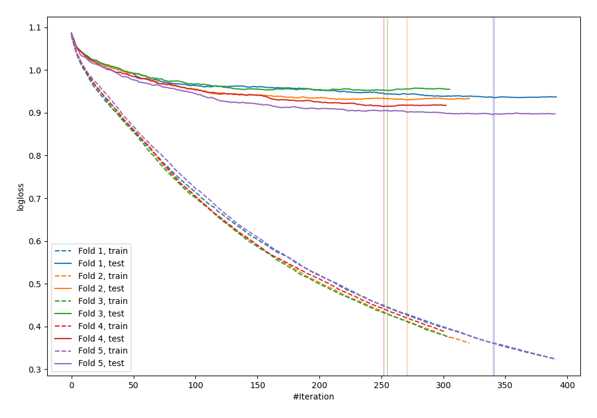
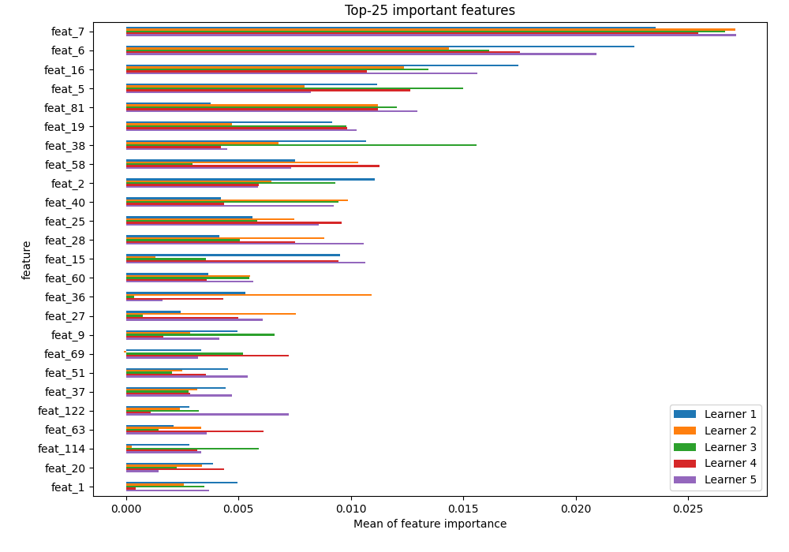
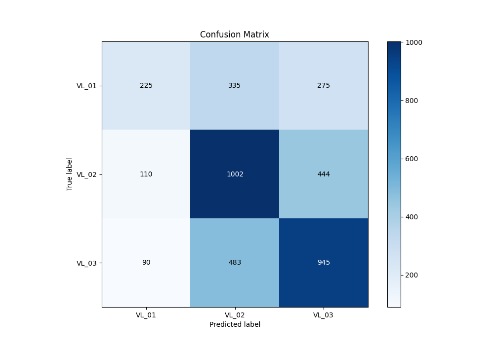
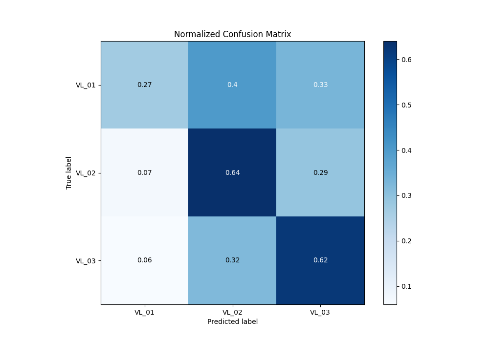
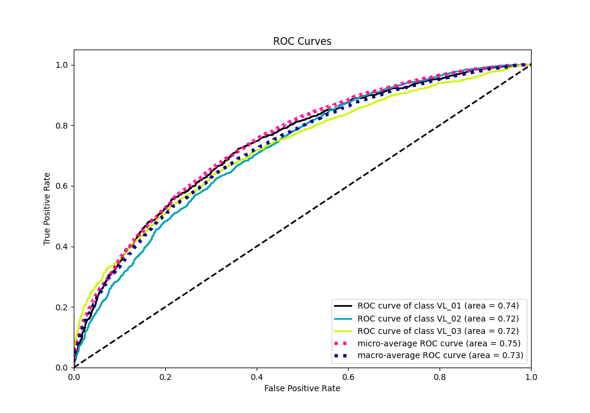
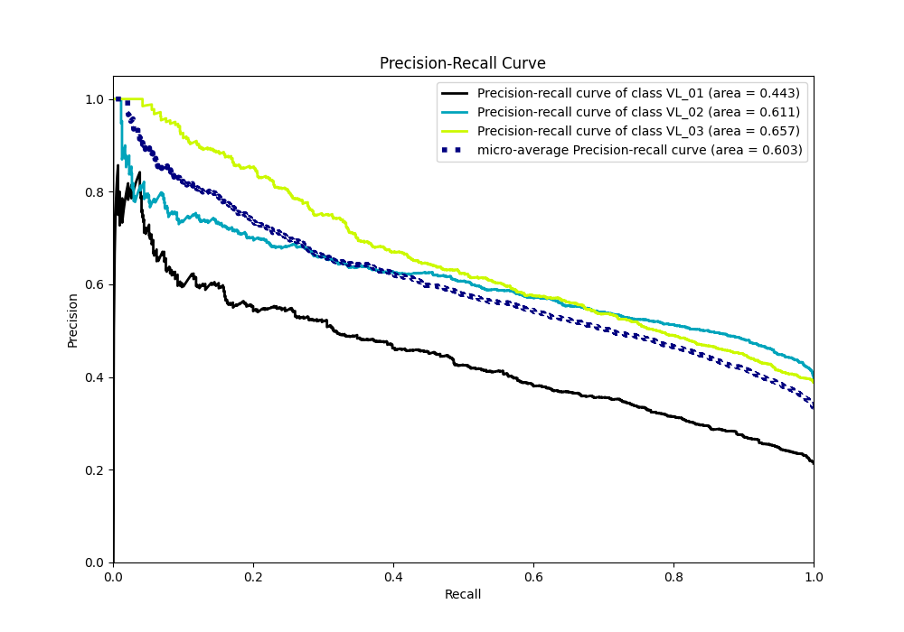

# Summary of 3_Default_CatBoost_GoldenFeatures

[<< Go back](../README.md)

## CatBoost
- **n_jobs**: -1
- **learning_rate**: 0.15
- **depth**: 5
- **rsm**: 1
- **loss_function**: MultiClass
- **eval_metric**: MultiClass
- **num_class**: 3
- **explain_level**: 2

## Validation
 - **validation_type**: kfold
 - **k_folds**: 5
 - **shuffle**: True
 - **stratify**: True

## Optimized metric
logloss

## Training time

239.6 seconds

### Metric details
|           |      VL_01 |       VL_02 |       VL_03 |   accuracy |   macro avg |   weighted avg |   logloss |
|:----------|-----------:|------------:|------------:|-----------:|------------:|---------------:|----------:|
| precision |   0.529412 |    0.550549 |    0.567909 |   0.555641 |    0.54929  |       0.552775 |  0.925697 |
| recall    |   0.269461 |    0.643959 |    0.62253  |   0.555641 |    0.511983 |       0.555641 |  0.925697 |
| f1-score  |   0.357143 |    0.593602 |    0.593966 |   0.555641 |    0.514904 |       0.543233 |  0.925697 |
| support   | 835        | 1556        | 1518        |   0.555641 | 3909        |    3909        |  0.925697 |

## Confusion matrix
|                  |   Predicted as VL_01 |   Predicted as VL_02 |   Predicted as VL_03 |
|:-----------------|---------------------:|---------------------:|---------------------:|
| Labeled as VL_01 |                  225 |                  335 |                  275 |
| Labeled as VL_02 |                  110 |                 1002 |                  444 |
| Labeled as VL_03 |                   90 |                  483 |                  945 |

## Learning curves

## Permutation-based Importance

## Confusion Matrix

## Normalized Confusion Matrix

## ROC Curve

## Precision Recall Curve

[<< Go back](../README.md)
