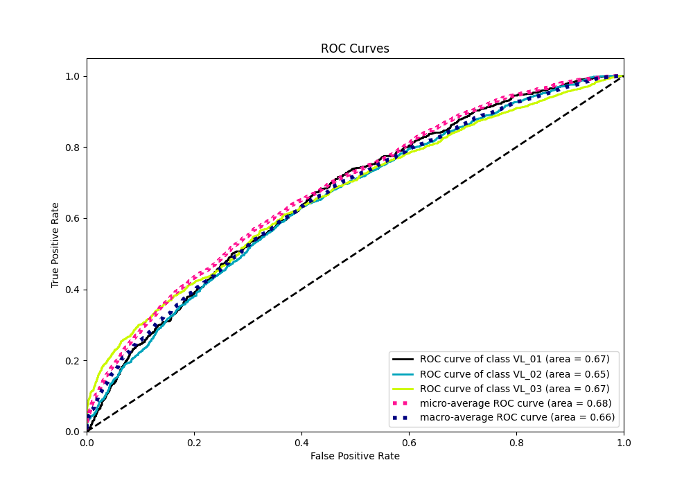

# Summary of 4_Default_RandomForest

[<< Go back](../README.md)

## Random Forest
- **n_jobs**: -1
- **criterion**: gini
- **max_features**: 0.9
- **min_samples_split**: 30
- **max_depth**: 4
- **eval_metric_name**: logloss
- **num_class**: 3
- **explain_level**: 2

## Validation
 - **validation_type**: kfold
 - **k_folds**: 5
 - **shuffle**: True
 - **stratify**: True

## Optimized metric
logloss

## Training time

197.3 seconds

### Metric details
|           |   VL_01 |       VL_02 |       VL_03 |   accuracy |   macro avg |   weighted avg |   logloss |
|:----------|--------:|------------:|------------:|-----------:|------------:|---------------:|----------:|
| precision |       0 |    0.469865 |    0.528602 |   0.489895 |    0.332823 |       0.392307 |   1.00816 |
| recall    |       0 |    0.761568 |    0.480896 |   0.489895 |    0.414155 |       0.489895 |   1.00816 |
| f1-score  |       0 |    0.581167 |    0.503622 |   0.489895 |    0.361596 |       0.426911 |   1.00816 |
| support   |     835 | 1556        | 1518        |   0.489895 | 3909        |    3909        |   1.00816 |

## Confusion matrix
|                  |   Predicted as VL_01 |   Predicted as VL_02 |   Predicted as VL_03 |
|:-----------------|---------------------:|---------------------:|---------------------:|
| Labeled as VL_01 |                    0 |                  550 |                  285 |
| Labeled as VL_02 |                    5 |                 1185 |                  366 |
| Labeled as VL_03 |                    1 |                  787 |                  730 |

## Learning curves

## Permutation-based Importance

## Confusion Matrix

## Normalized Confusion Matrix

## ROC Curve

## Precision Recall Curve

[<< Go back](../README.md)
