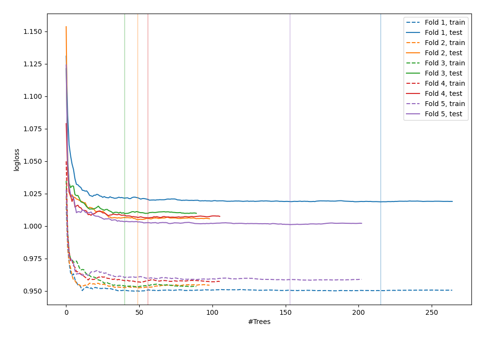
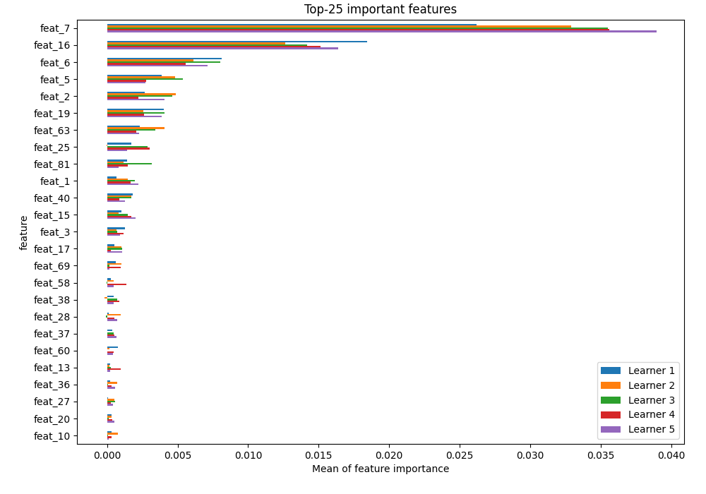
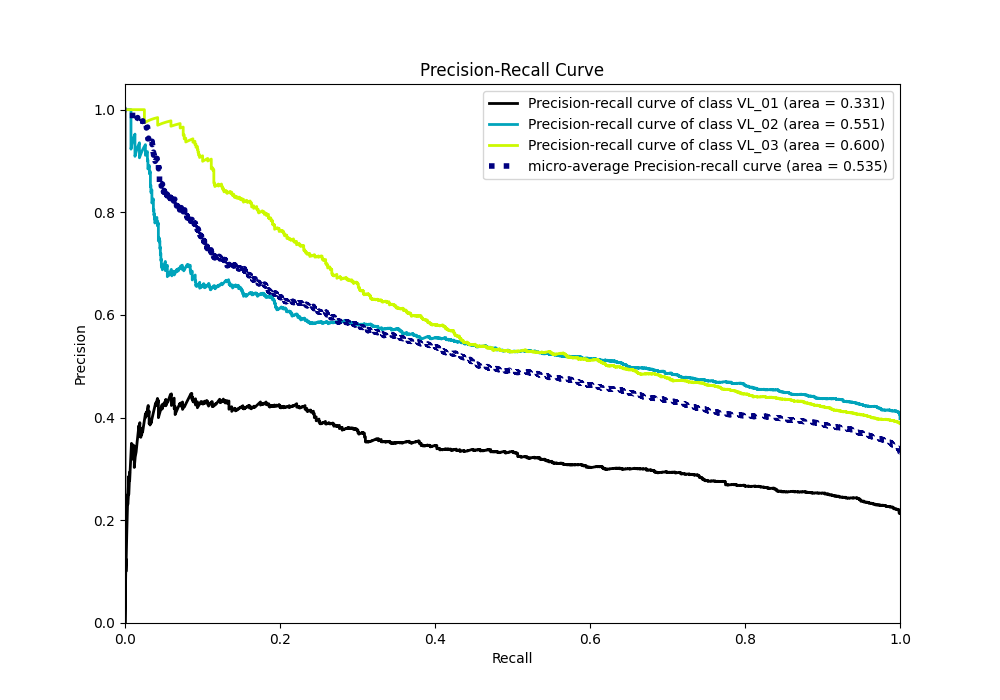

# Summary of 4_Default_RandomForest

[<< Go back](../README.md)

## Random Forest
- **n_jobs**: -1
- **criterion**: gini
- **max_features**: 0.9
- **min_samples_split**: 30
- **max_depth**: 4
- **eval_metric_name**: logloss
- **num_class**: 3
- **explain_level**: 2

## Validation
 - **validation_type**: split
 - **train_ratio**: 0.75
 - **shuffle**: True
 - **stratify**: True

## Optimized metric
logloss

## Training time

26.7 seconds

### Metric details
|           |   VL_01 |      VL_02 |      VL_03 |   accuracy |   macro avg |   weighted avg |   logloss |
|:----------|--------:|-----------:|-----------:|-----------:|------------:|---------------:|----------:|
| precision |       0 |   0.471726 |   0.542484 |   0.493865 |    0.33807  |       0.39841  |   1.00834 |
| recall    |       0 |   0.81491  |   0.436842 |   0.493865 |    0.417251 |       0.493865 |   1.00834 |
| f1-score  |       0 |   0.597549 |   0.483965 |   0.493865 |    0.360505 |       0.425719 |   1.00834 |
| support   |     209 | 389        | 380        |   0.493865 |  978        |     978        |   1.00834 |

## Confusion matrix
|                  |   Predicted as VL_01 |   Predicted as VL_02 |   Predicted as VL_03 |
|:-----------------|---------------------:|---------------------:|---------------------:|
| Labeled as VL_01 |                    0 |                  141 |                   68 |
| Labeled as VL_02 |                    0 |                  317 |                   72 |
| Labeled as VL_03 |                    0 |                  214 |                  166 |

## Learning curves

## Permutation-based Importance

## Confusion Matrix

## Normalized Confusion Matrix

## ROC Curve

## Precision Recall Curve

[<< Go back](../README.md)
