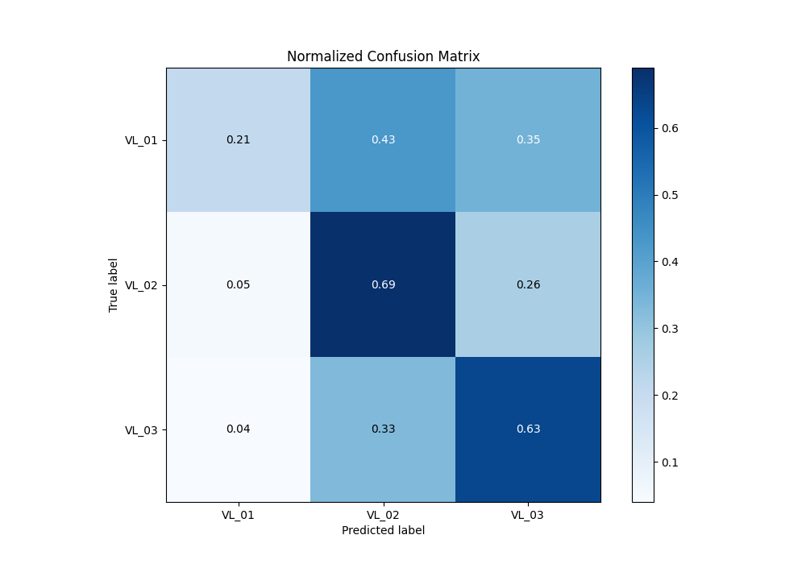

# Summary of 5_Xgboost

[<< Go back](../README.md)

## Extreme Gradient Boosting (Xgboost)
- **n_jobs**: -1
- **objective**: multi:softprob
- **eta**: 0.1
- **max_depth**: 7
- **min_child_weight**: 5
- **subsample**: 1.0
- **colsample_bytree**: 0.5
- **eval_metric**: mlogloss
- **num_class**: 3
- **explain_level**: 2

## Validation
 - **validation_type**: kfold
 - **k_folds**: 5
 - **shuffle**: True
 - **stratify**: True

## Optimized metric
logloss

## Training time

95.6 seconds

### Metric details
|           |      VL_01 |       VL_02 |       VL_03 |   accuracy |   macro avg |   weighted avg |   logloss |
|:----------|-----------:|------------:|------------:|-----------:|------------:|---------------:|----------:|
| precision |   0.547692 |    0.555212 |    0.577764 |   0.564083 |    0.560223 |       0.562363 |  0.929629 |
| recall    |   0.213174 |    0.691517 |    0.626482 |   0.564083 |    0.510391 |       0.564083 |  0.929629 |
| f1-score  |   0.306897 |    0.615913 |    0.601138 |   0.564083 |    0.507982 |       0.544166 |  0.929629 |
| support   | 835        | 1556        | 1518        |   0.564083 | 3909        |    3909        |  0.929629 |

## Confusion matrix
|                  |   Predicted as VL_01 |   Predicted as VL_02 |   Predicted as VL_03 |
|:-----------------|---------------------:|---------------------:|---------------------:|
| Labeled as VL_01 |                  178 |                  363 |                  294 |
| Labeled as VL_02 |                   79 |                 1076 |                  401 |
| Labeled as VL_03 |                   68 |                  499 |                  951 |

## Learning curves

## Permutation-based Importance

## Confusion Matrix

## Normalized Confusion Matrix

## ROC Curve

## Precision Recall Curve

[<< Go back](../README.md)
