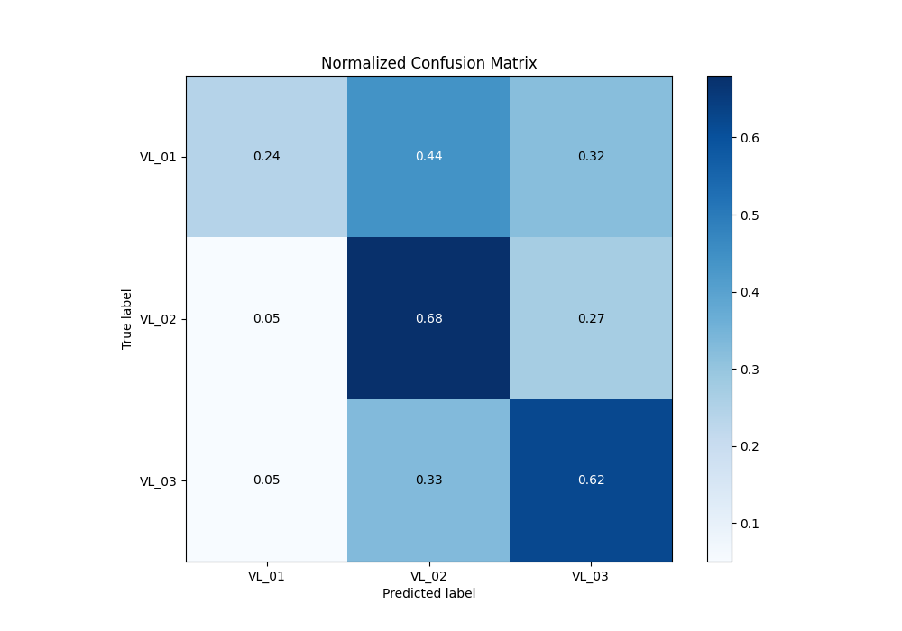

# Summary of 9_LightGBM

[<< Go back](../README.md)

## LightGBM
- **n_jobs**: -1
- **objective**: multiclass
- **num_leaves**: 95
- **learning_rate**: 0.1
- **feature_fraction**: 0.5
- **bagging_fraction**: 0.8
- **min_data_in_leaf**: 50
- **metric**: multi_logloss
- **custom_eval_metric_name**: None
- **num_class**: 3
- **explain_level**: 2

## Validation
 - **validation_type**: kfold
 - **k_folds**: 5
 - **shuffle**: True
 - **stratify**: True

## Optimized metric
logloss

## Training time

83.1 seconds

### Metric details
|           |      VL_01 |       VL_02 |       VL_03 |   accuracy |   macro avg |   weighted avg |   logloss |
|:----------|-----------:|------------:|------------:|-----------:|------------:|---------------:|----------:|
| precision |   0.560773 |    0.552029 |    0.580923 |    0.56485 |    0.564575 |       0.565118 |  0.932688 |
| recall    |   0.243114 |    0.681877 |    0.621871 |    0.56485 |    0.51562  |       0.56485  |  0.932688 |
| f1-score  |   0.339181 |    0.610121 |    0.6007   |    0.56485 |    0.516667 |       0.548587 |  0.932688 |
| support   | 835        | 1556        | 1518        |    0.56485 | 3909        |    3909        |  0.932688 |

## Confusion matrix
|                  |   Predicted as VL_01 |   Predicted as VL_02 |   Predicted as VL_03 |
|:-----------------|---------------------:|---------------------:|---------------------:|
| Labeled as VL_01 |                  203 |                  364 |                  268 |
| Labeled as VL_02 |                   82 |                 1061 |                  413 |
| Labeled as VL_03 |                   77 |                  497 |                  944 |

## Learning curves

## Permutation-based Importance

## Confusion Matrix

## Normalized Confusion Matrix

## ROC Curve

## Precision Recall Curve

[<< Go back](../README.md)
