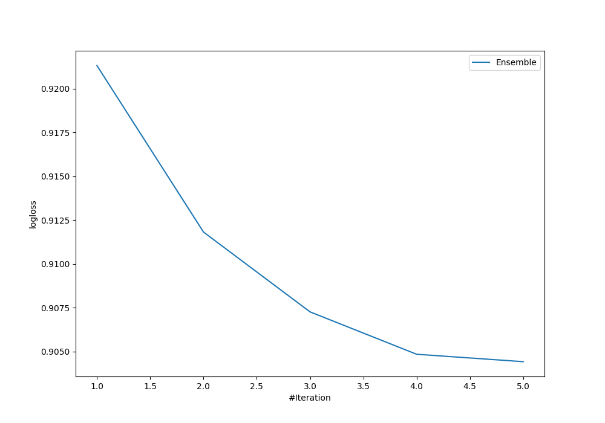

# Summary of Ensemble

[<< Go back](../README.md)

## Ensemble structure
| Model              |   Weight |
|:-------------------|---------:|
| 1_Default_LightGBM |        1 |
| 3_Default_CatBoost |        1 |

### Metric details
|           |      VL_01 |      VL_02 |      VL_03 |   accuracy |   macro avg |   weighted avg |   logloss |
|:----------|-----------:|-----------:|-----------:|-----------:|------------:|---------------:|----------:|
| precision |   0.522727 |   0.571142 |   0.616368 |   0.584867 |    0.570079 |       0.578368 |  0.907644 |
| recall    |   0.220096 |   0.732648 |   0.634211 |   0.584867 |    0.528985 |       0.584867 |  0.907644 |
| f1-score  |   0.309764 |   0.641892 |   0.625162 |   0.584867 |    0.525606 |       0.564415 |  0.907644 |
| support   | 209        | 389        | 380        |   0.584867 |  978        |     978        |  0.907644 |

## Confusion matrix
|                  |   Predicted as VL_01 |   Predicted as VL_02 |   Predicted as VL_03 |
|:-----------------|---------------------:|---------------------:|---------------------:|
| Labeled as VL_01 |                   46 |                   96 |                   67 |
| Labeled as VL_02 |                   21 |                  285 |                   83 |
| Labeled as VL_03 |                   21 |                  118 |                  241 |

## Learning curves

## Confusion Matrix

## Normalized Confusion Matrix

## ROC Curve

## Precision Recall Curve

[<< Go back](../README.md)
