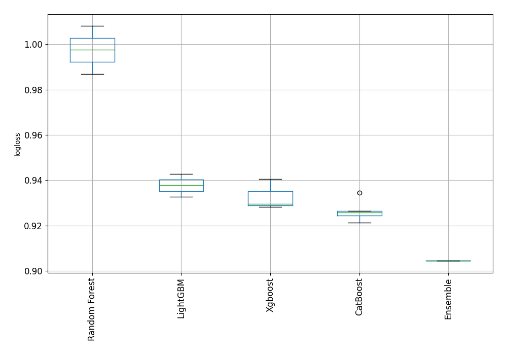

# AutoML Leaderboard

| Best model   | name                                                                             | model_type    | metric_type   |   metric_value |   train_time |   single_prediction_time |
|:-------------|:---------------------------------------------------------------------------------|:--------------|:--------------|---------------:|-------------:|-------------------------:|
|              | [1_Default_LightGBM](1_Default_LightGBM/README.md)                               | LightGBM      | logloss       |       0.942801 |       157.13 |                   0.0776 |
|              | [2_Default_Xgboost](2_Default_Xgboost/README.md)                                 | Xgboost       | logloss       |       0.940617 |       113.11 |                   0.0804 |
|              | [3_Default_CatBoost](3_Default_CatBoost/README.md)                               | CatBoost      | logloss       |       0.924329 |       108.26 |                   0.0951 |
|              | [4_Default_RandomForest](4_Default_RandomForest/README.md)                       | Random Forest | logloss       |       1.00816  |       198.2  |                   0.1204 |
|              | [9_LightGBM](9_LightGBM/README.md)                                               | LightGBM      | logloss       |       0.932688 |        84.03 |                   0.0781 |
|              | [5_Xgboost](5_Xgboost/README.md)                                                 | Xgboost       | logloss       |       0.929629 |        96.52 |                   0.0798 |
|              | [13_CatBoost](13_CatBoost/README.md)                                             | CatBoost      | logloss       |       0.926525 |        60.94 |                   0.0948 |
|              | [17_RandomForest](17_RandomForest/README.md)                                     | Random Forest | logloss       |       0.986891 |       366.88 |                   0.1214 |
|              | [3_Default_CatBoost_GoldenFeatures](3_Default_CatBoost_GoldenFeatures/README.md) | CatBoost      | logloss       |       0.925697 |       240.53 |                   0.1406 |
|              | [18_CatBoost](18_CatBoost/README.md)                                             | CatBoost      | logloss       |       0.921314 |       121.35 |                   0.0936 |
|              | [19_CatBoost](19_CatBoost/README.md)                                             | CatBoost      | logloss       |       0.934521 |        78.55 |                   0.0964 |
|              | [20_Xgboost](20_Xgboost/README.md)                                               | Xgboost       | logloss       |       0.92834  |        94.91 |                   0.0779 |
| **the best** | [Ensemble](Ensemble/README.md)                                                   | Ensemble      | logloss       |       0.904425 |         0.47 |                   0.4846 |

### AutoML Performance

### AutoML Performance Boxplot

### Features Importance

### Spearman Correlation of Models

